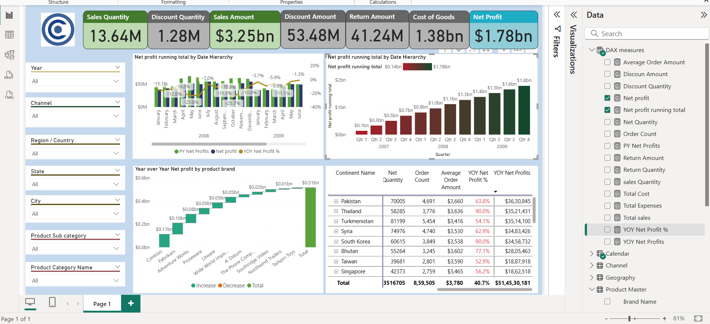

# Contoso-sales-analysis-PowerBI

## 📌 Project Overview

This project is an **interactive Power BI dashboard** that provides insights into **sales, profit, discounts, and returns** across multiple regions, products, and time periods.
The dashboard enables businesses to track **key performance indicators (KPIs)**, analyze **year-over-year performance**, and drill down into detailed trends for decision-making.

## 🎯 Goals
- Build a clean data model by connecting multiple tables (Sales, Product Master, Store, Channel, Geography, Calendar).
- Analyze **sales and profitability** trends across different dimensions (time, geography, product categories).
- Develop KPIs and measures for evaluating performance.
- Create an interactive dashboard to support business decision-making.

## 📊 Features & Insights
- **KPIs on Top Cards**:  
  - Sales Quantity  
  - Discount Quantity  
  - Sales Amount  
  - Discount Amount  
  - Return Amount  
  - Cost of Goods  
  - Net Profit  

- **Visuals Included**:
  - **Running Total Net Profit (by Date Hierarchy & Quarter)**  
  - **Year-over-Year (YoY) Net Profit by Product Brand** (Waterfall Chart)  
  - **Geographical Profitability** (Drill-down by Continent → Country → Region)  
  - **Expense vs Net Profit Table** with expandable hierarchy  

- **Slicers for Dynamic Filtering**:  
  Year, Channel, Region, State, City, Product Subcategory, Product Category

## 🧮 DAX Measures Used
Some of the important **DAX measures** implemented:  

```DAX
- Total Cost = SUM(sales[Total Cost])
- Total sales = SUM(sales[Sales Amount])
- Total Expenses = [Discoun Amount]+[Return Amount]+[Total Cost]
- Net Profit = [Total sales] - [Total Expenses]
- Net Profit Running Total =
-CALCULATE(
	[Net profit],
	FILTER(
		ALLSELECTED('Calendar'[Date]),
		ISONORAFTER('Calendar'[Date], MAX('Calendar'[Date]), DESC)
	)
)
- PY Net Profits = CALCULATE([Net profit],DATEADD('Calendar'[Date],-1,YEAR))
- Average Order Amount = DIVIDE([Total sales],[Order Count])
- sales Quantity = SUM(sales[Sales Quantity])
- Discoun Amount = SUM(sales[Discount Amount])
- Discount Quantity = sum(sales[Discount Quantity])
- Return Amount = SUM(sales[Return Amount])
- Return Quantity = SUM(sales[Return Quantity])
- Order Count = DISTINCTCOUNT(sales[Sales Key])
- YOY Net Profits =[Net profit]-[PY Net Profits]
- YOY Net Profit % = DIVIDE([YOY Net Profits],[PY Net Profits])
```


## 🛠️ Tech Used
- Power BI  
- DAX (Data Analysis Expressions)  
- Data Modeling  

🚀 Insights Derived

- Sales peaked during Q4 2008 & Q1 2009, but YoY profit growth slowed due to higher returns.
- Asia contributed the highest profit, with India and Japan leading.
- Discount strategies significantly reduced profit margins in categories like Phones and Consumer Electronics.
- Adventure Works & Wide World Importers showed strong year-over-year growth despite overall decline.
---
