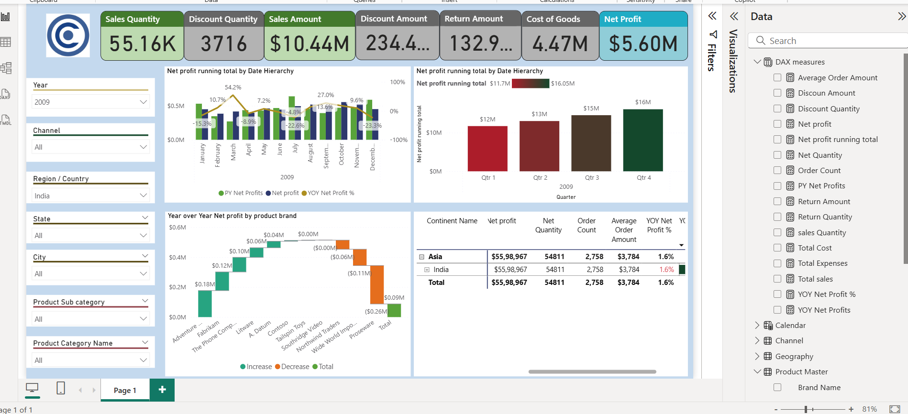

# Contoso-sales-analysis-PowerBI
## 📌 Project Overview

This project is an **interactive Power BI dashboard** that provides insights into **sales, profit, discounts, and returns** across multiple regions, products, and time periods.
The dashboard enables businesses to track **key performance indicators (KPIs)**, analyze **year-over-year performance**, and drill down into detailed trends for decision-making.

## 🎯 Goals
- Build a clean data model by connecting multiple tables (Sales, Product Master, Store, Channel, Geography, Calendar).
- Analyze **sales and profitability** trends across different dimensions (time, geography, product categories).
- Develop KPIs and measures for evaluating performance.
- Create an interactive dashboard to support business decision-making.

## 📊 Features & Insights
- **KPIs on Top Cards**:  
  - Sales Quantity  
  - Discount Quantity  
  - Sales Amount  
  - Discount Amount  
  - Return Amount  
  - Cost of Goods  
  - Net Profit  

- **Visuals Included**:
  - **Running Total Net Profit (by Date Hierarchy & Quarter)**  
  - **Year-over-Year (YoY) Net Profit by Product Brand** (Waterfall Chart)  
  - **Geographical Profitability** (Drill-down by Continent → Country → Region)  
  - **Expense vs Net Profit Table** with expandable hierarchy  

- **Slicers for Dynamic Filtering**:  
  Year, Channel, Region, State, City, Product Subcategory, Product Category

## 🧮 DAX Measures Used
Some of the important **DAX measures** implemented:  

```DAX
- Net Profit = [Total Sales] - [Total Cost] - [Discount Amount] - [Return Amount]
- Net Profit Running Total =
- CALCULATE(
    [Net Profit],
    FILTER(ALLSELECTED(Date), Date <= MAX(Date))
)
- YOY Net Profits =
- CALCULATE([Net Profit], DATEADD(Date[Date], -1, YEAR))
- Sales Quantity = SUM(FactSales[Quantity])
- Discount Quantity = SUM(FactSales[DiscountQty])
- Return Amount = SUM(FactSales[ReturnAmt])
- Total Expenses = SUM(FactFinance[Expenses])
- Order Count = DISTINCTCOUNT(FactSales[OrderID])
```

## 🖼️ Dashboard Screenshots



## 🛠️ Tech Used
- Power BI  
- DAX (Data Analysis Expressions)  
- Data Modeling  

🚀 Insights Derived

- Sales peaked during Q4 2008 & Q1 2009, but YoY profit growth slowed due to higher returns.
- Asia contributed the highest profit, with India and Japan leading.
- Discount strategies significantly reduced profit margins in categories like Phones and Consumer Electronics.
- Adventure Works & Wide World Importers showed strong year-over-year growth despite overall decline.
---
